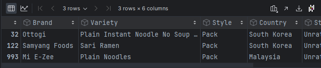
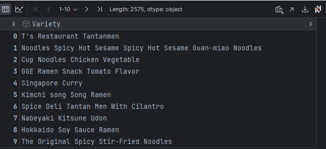
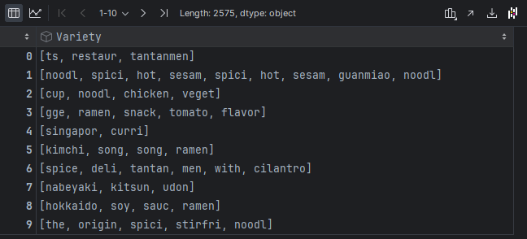
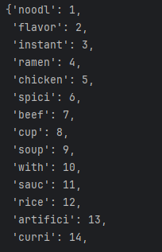
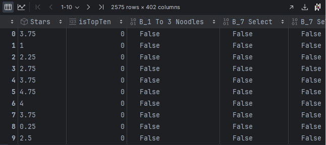
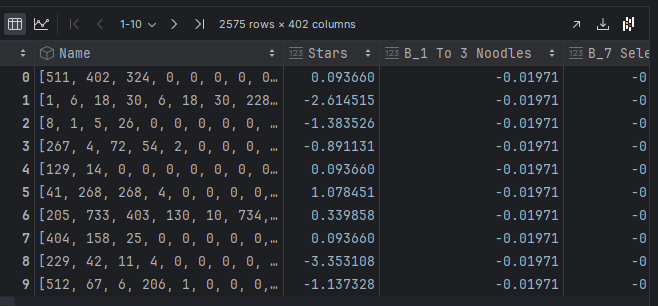
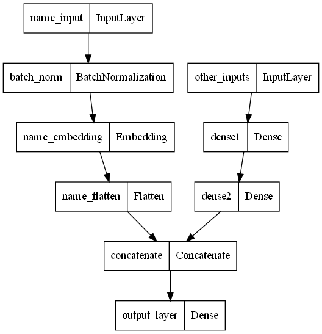
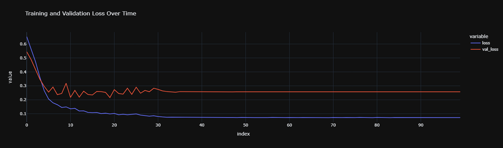

# Tổng Quan Dự Án Dự Đoán Ramen Rating
**Giới thiệu:**

Mục tiêu của dự án này là dự đoán xem một món ramen cụ thể có được xếp hạng là "Top 10" hay không, sử dụng một mạng neural đa đầu vào (multi-input) của TensorFlow. Dự án kết hợp cả các đặc trưng dạng danh mục (categorical) và dạng số (numerical), và sau đó tích hợp chúng vào mô hình mạng neural để tạo ra các dự đoán chính xác. Mô hình này nhận vào hai nhóm đặc trưng: tên của ramen (được xử lý dưới dạng chuỗi) và các thuộc tính khác liên quan đến ramen (như thương hiệu, quốc gia và đánh giá).

# 1. Tiền xử lý dữ liệu

## 1.1 Mục Đích:
Trước khi huấn luyện mô hình, điều cần thiết là làm sạch và chuẩn bị dữ liệu để đảm bảo mô hình học một cách hiệu quả. Việc tiền xử lý dữ liệu đúng cách giúp mô hình tổng quát hóa tốt hơn trên dữ liệu chưa từng thấy và cải thiện hiệu suất của nó.

## 1.2 Cách làm:

### 1.2.1. Xử lý giá trị thiếu: 
Nguyên Nhân: Dữ liệu thiếu có thể làm sai lệch sự hiểu biết của mô hình về phân phối dữ liệu. 
Cách làm: Loại bỏ các hàng/cột có quá nhiều dữ liệu thiếu. Những giá trị không được đánh giá.

### 1.2.2. Kỹ thuật tạo đặc trưng mới:
Nguyên Nhân: Tạo đặc trưng mới có thể giúp mô hình nắm bắt được nhiều thông tin hữu ích hơn từ dữ liệu. 
Cách làm: Tạo ra các đặc trưng mới hoặc biến đổi các đặc trưng hiện có (ví dụ: trích xuất độ dài của tên ramen, tạo các tương tác giữa các đặc trưng).

**Before**

**After**

### 1.2.3. Token hóa: 
Nguyên Nhân: Dữ liệu văn bản cần được chuyển đổi sang định dạng số mà mô hình có thể xử lý. 

Cách làm: Sử dụng tokenizer để chuyển dữ liệu văn bản (ví dụ: tên ramen) thành các chuỗi số nguyên, đại diện cho các từ trong tên ramen.

### 1.2.4. Mã hóa biến danh mục (Categorical Encoding): 
Nguyên Nhân: Dữ liệu dạng danh mục cần được chuyển đổi sang định dạng số. 

Cách làm: Sử dụng one-hot encoding để biến đổi dữ liệu danh mục thành các vector nhị phân. (False = 0, True = 1)

### 1.2.5. Chuẩn hóa (Normalization): 
Nguyên Nhân: Mỗi tên có độ dài khác nhau sẽ tạo ra độ dài chuỗi không cân bằng và gây lỗi cho tensorflow. Nên mọi tên sẽ được chuyển sang dạng chuỗi có độ dài cố định, những ký tự ko tồn tại sẽ được thay bằng 0 trong chuỗi ký tự. Nên chuẩn hóa các đặc trưng số giúp mô hình học hiệu quả hơn bằng cách đưa các đặc trưng về cùng một thang đo. 

Cách làm: Chuẩn hóa các đặc trưng số để chúng có giá trị trung bình là 0 và độ lệch chuẩn là 1.

### 1.2.6. Chia tách dữ liệu: 
Nguyên Nhân: Để đánh giá hiệu suất của mô hình, cần chia tách dữ liệu thành tập huấn luyện và tập kiểm tra. 

Cách làm: Sử dụng train_test_split để chia dữ liệu thành các tập huấn luyện và kiểm tra.

# 2. Kiến trúc mạng neural
**Mục Đích**
Kiến trúc mạng neural được định nghĩa dựa trên tính chất của dữ liệu đầu vào và nhiệm vụ dự đoán. Vì chúng ta có cả dữ liệu chuỗi (tên ramen) và dữ liệu bảng (các đặc trưng khác), ta sử dụng một mạng neural đa đầu vào. Điều này cho phép xử lý từng loại đầu vào riêng biệt và sau đó kết hợp chúng để đưa ra dự đoán cuối cùng.

**Cách làm:**

**Lớp nhúng tên (Name Embedding):** Ta sử dụng một lớp nhúng (embedding layer) để biến đổi tên ramen thành các vector đặc dày (dense vector) với kích thước cố định. Sau đó, ta sử dụng lớp Flatten để chuẩn bị dữ liệu cho bước kết hợp.

**Lớp Dense cho các đặc trưng khác:** Đối với các đặc trưng khác, ta truyền chúng qua các lớp dense với hàm kích hoạt ReLU để nắm bắt các tương tác phức tạp.

**Kết hợp (Concatenation):** Ta kết hợp các đầu ra từ lớp nhúng tên và các đặc trưng khác, sau đó truyền chúng qua một lớp dense cuối cùng với hàm kích hoạt sigmoid để đưa ra dự đoán nhị phân (Top 10 hay không).

## Tổng quan Kiến trúc Mô hình
Các lớp đầu vào
name_input: Đây là một trong các lớp đầu vào dùng để xử lý dữ liệu văn bản (có thể là tên của các loại mì ramen). Nó được đưa vào một lớp BatchNormalization.
other_inputs: Đây là một lớp đầu vào khác dành cho các đặc trưng không phải văn bản (ví dụ: dữ liệu số hoặc dữ liệu phân loại). Nó được đưa trực tiếp vào một lớp Dense.

Nhánh 1 (Xử lý đầu vào văn bản)
Batch Normalization: Lớp này chuẩn hóa các đặc trưng đầu vào, giúp quá trình huấn luyện ổn định và hiệu quả hơn.
Embedding: Lớp name_embedding có thể được sử dụng để chuyển đổi đầu vào văn bản (ví dụ: tên các loại mì ramen) thành các biểu diễn vector dày đặc. Đây là một kỹ thuật phổ biến trong các nhiệm vụ xử lý ngôn ngữ tự nhiên.
Flatten: Sau lớp embedding, lớp Flatten sẽ chuyển đổi đầu ra từ lớp embedding thành một vector đơn, giúp nó tương thích để kết hợp với các đặc trưng khác.

Nhánh 2 (Xử lý các đầu vào khác)
Dense1: Lớp dense đầu tiên (dense1) xử lý các đặc trưng đầu vào không phải văn bản. Nó thêm một lớp phức tạp và trừu tượng cho dữ liệu đầu vào.
Dense2: Lớp dense thứ hai (dense2) tiếp tục xử lý đầu ra của dense1, thêm một mức độ trừu tượng khác.

Kết hợp
Concatenate: Lớp này kết hợp các đầu ra đã được xử lý từ cả hai nhánh (văn bản và các đầu vào không phải văn bản). Đây là một bước quan trọng để hợp nhất các đặc trưng đã học từ các loại dữ liệu khác nhau thành một biểu diễn duy nhất.

Lớp đầu ra
Dense (output_layer): Lớp Dense cuối cùng, có thể có một neuron duy nhất với hàm kích hoạt sigmoid nếu thầy đang thực hiện phân loại nhị phân (ví dụ: dự đoán xem một loại mì ramen có nằm trong Top 10 hay không). Lớp này đưa ra xác suất dự đoán.

# 3. Biên dịch và huấn luyện mô hình
Mục Đích
Để huấn luyện mạng neural, ta cần biên dịch mô hình với một bộ tối ưu hóa, hàm mất mát và các chỉ số đánh giá. Mô hình sau đó được huấn luyện trên dữ liệu huấn luyện, điều chỉnh các trọng số của nó để giảm thiểu hàm mất mát.
Cách làm:
Bộ tối ưu hóa (Optimizer): Ta sử dụng Adam optimizer vì khả năng điều chỉnh tốc độ học tự động của nó.
Hàm mất mát (Loss Function): Ta sử dụng binary crossentropy vì nó phù hợp cho các nhiệm vụ phân loại nhị phân.
Chỉ số (Metrics): Ta theo dõi accuracy, AUC, precision và recall trong quá trình huấn luyện.

# 4. Đánh giá mô hình
Mục Đích
Sau khi huấn luyện, ta đánh giá hiệu suất của mô hình trên tập kiểm tra để đảm bảo nó tổng quát hóa tốt cho dữ liệu mới. Điều này giúp ta hiểu rõ hơn về hiệu quả của mô hình trong các kịch bản thực tế.

Cách làm:
Đánh giá trên tập kiểm tra: Mô hình được đánh giá trên dữ liệu kiểm tra chưa từng thấy trước đó, sử dụng các chỉ số tương tự như khi huấn luyện.
Hiển thị kết quả: Ta in ra các giá trị accuracy, AUC, precision và recall để đánh giá hiệu suất của mô hình.

Epoch 2/100
23/23 [==============================] - 0s 5ms/step - loss: 0.5488 - accuracy: 0.8897 - auc: 0.8790 - prec: 0.0898 - rec: 0.6818 - val_loss: 0.4830 - val_accuracy: 0.8310 - val_auc: 0.7636 - val_prec: 0.0656 - val_rec: 0.5000 - lr: 0.0010

Epoch 51/100
23/23 [==============================] - 0s 5ms/step - loss: 0.0832 - accuracy: 0.9542 - auc: 0.9919 - prec: 0.2500 - rec: 1.0000 - val_loss: 0.2268 - val_accuracy: 0.9169 - val_auc: 0.8134 - val_prec: 0.1562 - val_rec: 0.6250 - lr: 1.0000e-07

Epoch 100/100
23/23 [==============================] - 0s 5ms/step - loss: 0.0828 - accuracy: 0.9535 - auc: 0.9922 - prec: 0.2472 - rec: 1.0000 - val_loss: 0.2269 - val_accuracy: 0.9169 - val_auc: 0.8134 - val_prec: 0.1562 - val_rec: 0.6250 - lr: 1.0000e-11

# 5. Trực quan hóa kết quả
Mục Đích
Trực quan hóa quá trình huấn luyện và hiệu suất của mô hình cung cấp cái nhìn sâu sắc về mức độ học của mô hình và liệu có hiện tượng quá khớp (overfitting) hoặc dưới khớp (underfitting) hay không.

Cách làm:
Biểu đồ mất mát (Loss Curves): Ta vẽ biểu đồ biểu diễn mất mát huấn luyện và mất mát kiểm tra theo các epoch để giám sát quá trình huấn luyện và kiểm tra hiện tượng overfitting.

# 6. Kết luận
## 6.1. Accuracy
Giá trị: 0.92109

Giải thích: Mô hình có khả năng phân loại chính xác 92.1% các đánh giá ramen trong tập kiểm tra. Mặc dù con số này có vẻ cao, nhưng accuracy có thể gây nhầm lẫn trong các tập dữ liệu mất cân bằng, nơi một lớp (ví dụ: không thuộc Top 10) chiếm ưu thế. Trong trường hợp này, mô hình có thể đang phân loại chính xác nhiều đánh giá không thuộc Top 10, làm tăng giá trị accuracy, nhưng điều này không nhất thiết nghĩa là mô hình hoạt động tốt trong việc dự đoán các đánh giá Top 10.

## 6.2. AUC (Diện tích dưới đường cong ROC):
Giá trị: 0.80921

Giải thích: AUC là 0.80921 cho thấy mô hình có khả năng tốt trong việc phân biệt giữa các lớp Top 10 và không phải Top 10. AUC gần 0.8 cho thấy mô hình hiệu quả trong việc xếp hạng các đánh giá ramen, nghĩa là nó có thể sắp xếp chính xác các dự đoán từ ít có khả năng đến có khả năng cao sẽ thuộc Top 10.

## 6.3. Precision

Giá trị: 0.07812

Giải thích: Precision thấp đáng kể ở mức 7.8%, nghĩa là khi mô hình dự đoán một ramen thuộc Top 10, nó chỉ đúng 7.8% trong các trường hợp đó. Precision thấp này cho thấy mô hình đang dự đoán quá mức lớp Top 10, dẫn đến nhiều kết quả dương giả (false positives). Đây là một vấn đề đáng kể, đặc biệt nếu mục tiêu là giảm thiểu số lượng dự đoán Top 10 sai.

## 6.4. Recall
Giá trị: 0.71429
Giải thích: Recall là 71.4% cho thấy mô hình có khả năng xác định 71.4% tất cả các đánh giá ramen thực sự thuộc Top 10. Mặc dù điều này cho thấy mô hình tương đối tốt trong việc tìm kiếm các đánh giá Top 10, nhưng nó phải trả giá bằng precision, dẫn đến nhiều kết quả dương giả.

# 7. Kết luận tổng thể:
Hiệu suất cân bằng: Mô hình cho thấy hiệu suất tốt trong việc phân biệt giữa các lớp, như được chỉ ra bởi AUC. Tuy nhiên, sự đánh đổi giữa precision và recall bị lệch nhiều về phía recall. Mô hình tập trung hơn vào việc xác định càng nhiều đánh giá Top 10 càng tốt, điều này dẫn đến nhiều kết quả dương giả, do đó precision thấp.

Ảnh hưởng của dữ liệu mất cân bằng: Tập dữ liệu có khả năng mất cân bằng đáng kể giữa số lượng đánh giá Top 10 và không Top 10. Sự mất cân bằng này khiến mô hình trở nên quá mạnh mẽ trong việc dự đoán lớp dương (Top 10), dẫn đến recall cao nhưng precision thấp.

# 8. Các cải tiến tiềm năng:
Điều chỉnh ngưỡng (Threshold Adjustment): Điều chỉnh ngưỡng quyết định có thể giúp tăng precision, mặc dù điều này có thể làm giảm recall.

Trọng số lớp (Class Weights): Áp dụng trọng số lớp hoặc sử dụng các kỹ thuật như SMOTE có thể giúp mô hình cân bằng tốt hơn giữa precision và recall.
Tối ưu hóa mô hình: Tối ưu hóa thêm về kiến trúc mô hình, siêu tham số, hoặc thậm chí thử nghiệm với các mô hình khác (ví dụ: phương pháp ensemble) có thể mang lại precision tốt hơn.

Cân nhắc trường hợp sử dụng: Tùy thuộc vào nhu cầu của ứng dụng, mô hình này có thể cần được tinh chỉnh thêm. Nếu mục tiêu là giảm thiểu các kết quả dương giả và đạt được precision cao hơn, em sẽ cần điều chỉnh cách tiếp cận của mình để ưu tiên precision hơn recall.

Tóm lại, trong khi mô hình tốt trong việc xác định các đánh giá ramen có tiềm năng thuộc Top 10, nó cần cải thiện để giảm số lượng kết quả dương giả, điều này được thể hiện qua precision thấp.

